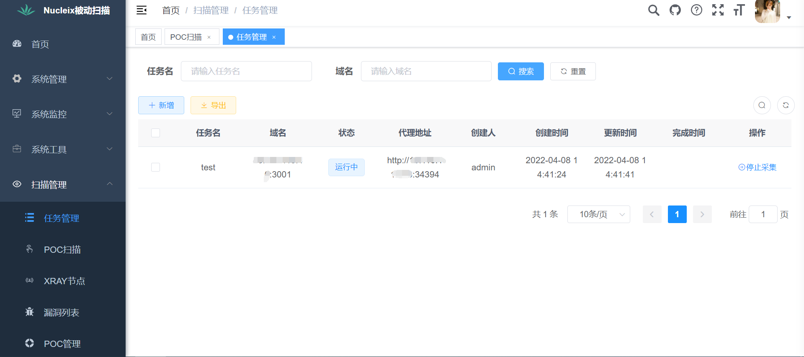
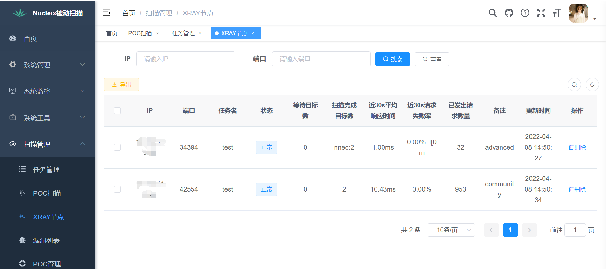
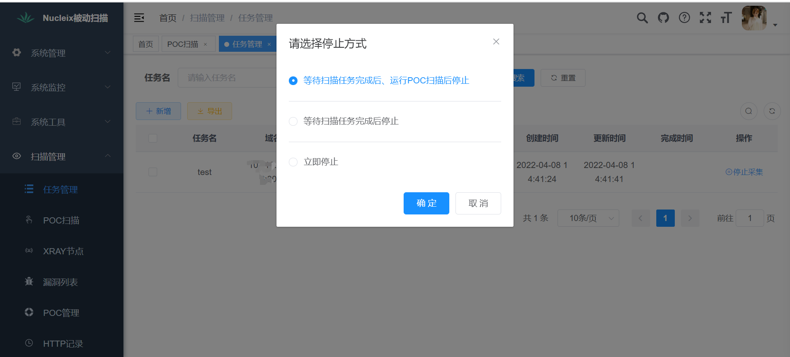
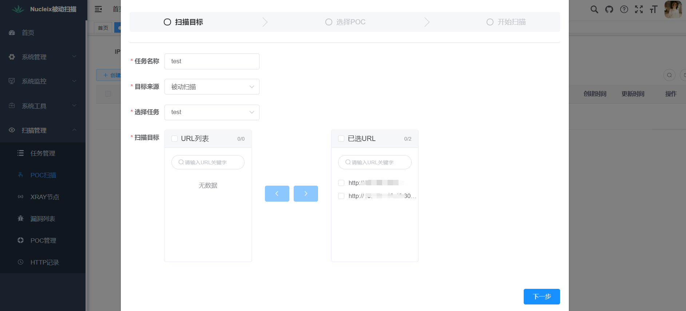
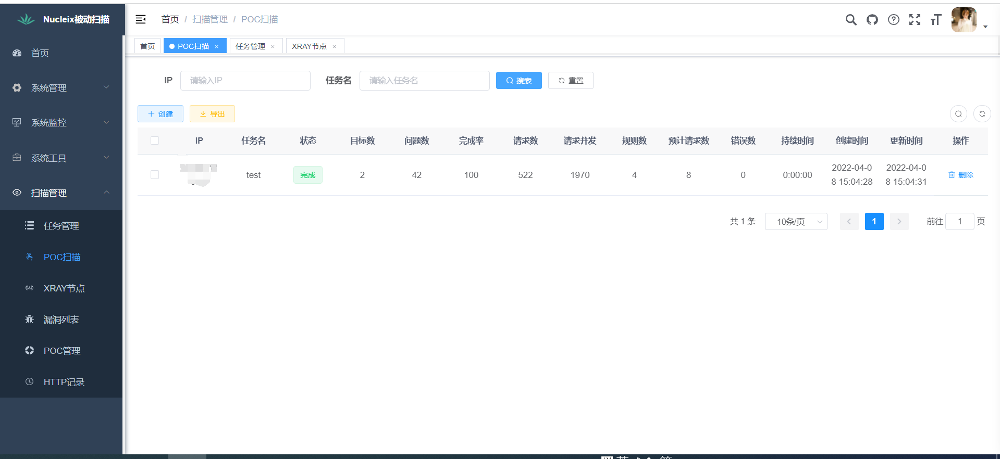
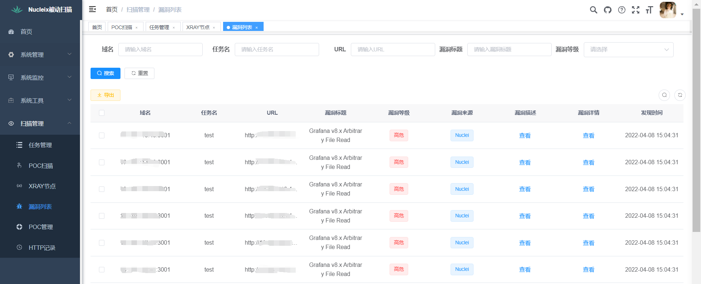
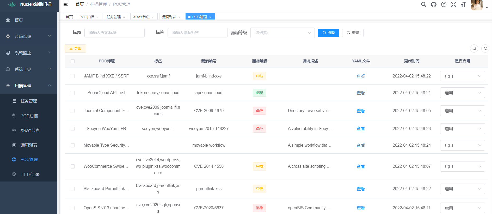
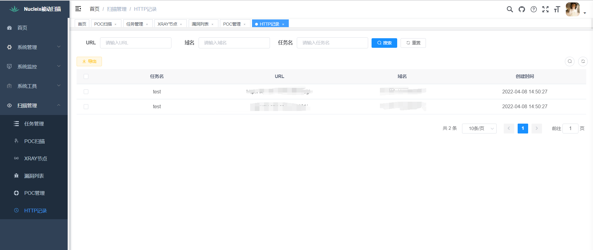

## nucleix

整合nuclei与xray(社区版、自带高级版)，实现被动扫描+poc扫描自动化渗透流程

使用[ruoyi前后端分离版本](https://gitee.com/y_project/RuoYi-Vue)进行二次开发

### 功能列表

#### 创建扫描任务

将浏览器或者bp等工具代理设置为生成的代理服务器地址即可自动调用xray进行被动漏洞扫描

会自动生成两个xray节点 
高级版仅开启shiro、fastjson、struts2、thinkphp等社区版受限制的漏洞插件 
流量流经高级版后会自动流向社区版再次进行漏洞扫描
#### 创建POC扫描
POC扫描使用nuclei进行扫描 
支持两种方式创建扫描 
1.停止采集时将采集到的流量全部去重后进行POC扫描 

2.手动创建POC扫描-手动输入目标或从被动扫描任务处选取目标

选择POC支持标签选择与poc选择

poc扫描状态

#### 漏洞列表
扫描完成后的漏洞统一在此查看

#### POC列表
对nuclei的poc进行可视化管理

#### 请求记录
记录被动扫描采集到的原始url，供POC扫描使用

